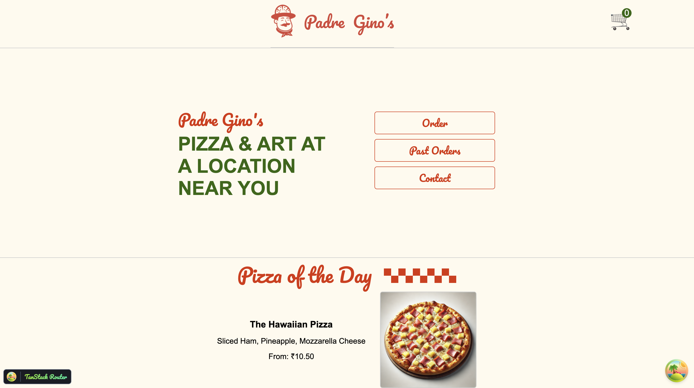

# React FEM Practice

## Features

- Responsive design
- Dynamic components with React
- State management using hooks
- Interactive UI elements.

## Tech Stack

- React
- Vite
- CSS 
- ESLint, Prettier (for formatiig)
  

## Installation

- Install dependencies:
   npm install

- Start the development server:
   npm run dev

## Testing

- Run tests using: (I have used vitest)
- npm test

## Demo

## Acknowledgements

- Learned from the Frontend Masters course on React.

